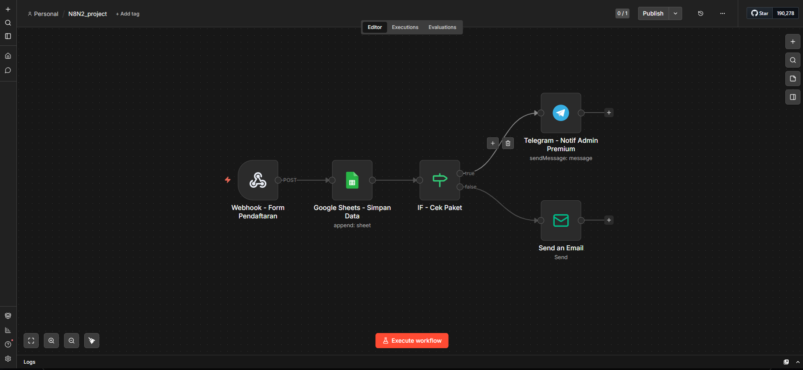

# Automated Lead Routing System for Ad Consultancy

An automation prototype designed to eliminate manual lead screening 
bottlenecks in advertising consultancy operations — enabling instant, 
tier-based client routing from form submission to delivery.

---

## Problem
In many ad consultancies, every inbound lead is manually reviewed by 
an admin before receiving a response — creating delays that risk 
losing potential clients.

## Solution
A multi-tier automated workflow built in n8n that filters and routes 
leads instantly based on budget and service tier, without any manual 
intervention.

## Workflow Architecture
1. **Webhook - Form Pendaftaran** — Captures incoming lead data in real-time upon form submission
2. **Google Sheets - Simpan Data** — Automatically logs lead information into a centralized spreadsheet
3. **IF - Cek Paket** — Evaluates lead tier based on budget and service needs
4. **Telegram - Notif Admin Premium** — Instantly notifies admin for high-intent premium leads
5. **Send an Email** — Automatically delivers digital materials or scheduling links to the regular client

## Tech Stack
- n8n (workflow automation)
- Google Sheets API
- Telegram API
- Gmail API
- Webhooks

## How to Use
1. Download `n8n-automated-lead-routing.json`
2. Open your n8n instance
3. Click on the three dots (top right) → **Import from File**
4. Upload the JSON file
5. Configure your own credentials for each node and activate the workflow

## Disclaimer
All data shown in this workflow is fictional and used for demonstration 
purposes only. This is an independent prototype and has not been 
implemented by any specific company.
